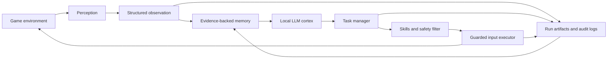

<div align="center">

# Autonomous Game Agent

### An evidence-grounded AI architecture for autonomous perception, memory, planning, learning and safe action in game environments.


</div>

> **Observe what is visible. Remember what is evidenced. Act through controlled interfaces.**

## Overview

Autonomous Game Agent is an experimental architecture for building AI agents
that can operate independently inside interactive game environments.

The project explores a difficult version of game autonomy: the agent should not
receive privileged access to internal game state, scripted solutions or hidden
world knowledge. It must instead construct its understanding from visible
evidence, maintain memory across time, choose goals, execute constrained
actions and evaluate the results.

The system is designed as a hierarchy rather than a single model controlling
every key press:

- perception converts visible input into structured observations;
- memory stores evidence, outcomes and reusable knowledge;
- a local language model proposes goals and reflects on results;
- a manager converts goals into bounded tasks;
- skills and safety filters decide which primitive actions are acceptable;
- an input executor applies those actions through guarded interfaces;
- audit tooling records what happened and why.

The current repository is a research prototype. It contains implementation
experiments and controlled-run tooling toward the target architecture, but the
canonical architecture is not a claim that every proposed component is already
implemented or integrated.

## Why this project exists

Game environments are useful testbeds for autonomous systems because they
combine several problems that are often isolated in simpler demonstrations:

- **partial observability** — the agent sees only part of the relevant world;
- **noisy perception** — visual and textual evidence may be incomplete or
  misclassified;
- **long-term memory** — useful facts and past failures must survive beyond one
  decision;
- **delayed consequences** — an action may appear safe before its cost becomes
  visible;
- **hierarchical control** — strategic goals and low-level inputs operate at
  different time scales;
- **action risk** — an incorrect input can invalidate a run or destroy useful
  state;
- **limited supervision** — the system should make progress without continuous
  human correction.

The project treats autonomy as an engineering problem built from explicit
boundaries, inspectable evidence and progressively validated capabilities.

## Agent loop



Every game-specific claim should be traceable to visible evidence. Every action
should pass through an explicit safety boundary. Every controlled run should
produce enough artifacts to explain what the system observed, attempted and
learned.

## Core capabilities

| Capability | Purpose |
|---|---|
| **Screen and frame capture** | Records timestamped visual evidence for offline processing and live-run review. |
| **Structured observations** | Converts visible state into validated models instead of passing unstructured text between components. |
| **Hidden-state firewall** | Allows visible information while rejecting internal identifiers, databases, flags and other privileged game state. |
| **Evidence-backed memory** | Stores observations, actions, skill outcomes and knowledge claims in SQLite with evidence references. |
| **Local LLM planning** | Uses an OpenAI-compatible local endpoint to select goals and produce structured post-mortems. |
| **Hierarchical task execution** | Separates high-level intent from bounded tasks, reusable skills and primitive actions. |
| **Safe navigation** | Scores movement candidates against target distance and observed hazard risk. |
| **Guarded input execution** | Blocks inputs when focus is incorrect, an emergency stop is active or the action rate is unsafe. |
| **Controlled live-run audits** | Produces preflight reports, run manifests, smoke plans, evidence and validation summaries. |
| **Learning scaffolding** | Provides synthetic Gymnasium environments, replay storage, HER relabeling and behavior-cloning foundations. |

## Architecture

### Perception and observation

The perception layer turns screenshots or allowed visible-state data into
validated observations.

Observations can contain information such as:

- visible interface state;
- visible text;
- screenshot and evidence identifiers;
- player or sprite screen positions;
- the result of the previous action;
- confidence and provenance information.

The architecture intentionally distinguishes raw evidence from interpreted
knowledge. A screenshot is evidence. A statement derived from it is a claim
that should retain a reference to that evidence.

### Hidden-state firewall

Optional bridges may expose information that is already visible to the player,
but they must not become an oracle.

The firewall rejects hidden fields such as:

- internal map or event identifiers;
- game switches and variables;
- enemy databases, exact health values or resistance tables;
- ending flags and save-state internals;
- item effects that have not been observed.

This allows debugging and controlled integration without silently changing the
epistemic rules of the experiment.

### Memory

The memory layer uses SQLite to store:

- observations;
- primitive action results;
- skill outcomes;
- evidence-linked knowledge facts;
- room and navigation information;
- entity risk;
- skill performance;
- strategy relationships.

Knowledge facts require evidence references. This prevents unsupported model
output from being treated as established game knowledge.

### Cortex

The Cortex is the planning boundary around a local language model.

It receives structured context rather than unrestricted repository or game
access. Its responsibilities include:

- selecting a local goal;
- choosing from available skills;
- identifying constraints and stopping conditions;
- citing evidence for game-specific claims;
- reflecting on completed or failed tasks.

Model output is validated before it can enter the execution pipeline. The
planner does not directly emit arbitrary key sequences.

### Manager and skills

The manager converts a proposed goal into an executable task with:

- a target;
- constraints;
- timeouts;
- reward terms;
- success and failure conditions;
- permitted skills.

Skills implement reusable behavior such as continuing dialogue, interacting
with visible objects or moving toward a target. Low-level actions remain
separate so that they can be tested, logged, blocked and replaced independently.

### Body and safety

Primitive inputs are executed only through a safety wrapper.

Current controls include:

- target-window focus checks;
- emergency-stop handling;
- input rate limiting;
- dry-run input backends;
- action-level result logging;
- risk-based movement filtering;
- safe fallback to `wait` when every movement candidate exceeds the configured
  risk threshold.

The system prefers refusing an action over executing one it cannot justify
safely.

### Learning layer

Reinforcement learning is treated as an optional later capability rather than
the foundation of the whole system.

The repository currently includes infrastructure for:

- Gymnasium-compatible synthetic tasks;
- replay transitions;
- task-conditioned experience;
- hindsight experience relabeling;
- behavior-cloning experiments.

Learning components are first validated on deterministic proxy environments
before being connected to controlled live interaction.

## Controlled run lifecycle

```text
Preflight
   ↓
Run manifest
   ↓
Dry-run or tightly scoped live smoke
   ↓
Observation and action evidence
   ↓
Artifact validation
   ↓
Manual visual review
   ↓
Stability summary and post-mortem
```

A controlled run verifies assumptions such as:

- the expected game window is available;
- resolution and focus requirements are satisfied;
- hidden-state access is disabled;
- emergency-stop behavior is configured;
- live inputs are explicitly enabled only for the intended scope;
- evidence and reports are written to the expected locations.

This process is intentionally more conservative than starting a long autonomous
session and inspecting the result afterward.

## Technical stack

| Layer | Technology |
|---|---|
| **Language** | Python 3.12 |
| **Models and validation** | Pydantic |
| **Command-line interface** | Typer and Rich |
| **Configuration** | YAML |
| **Persistent memory** | SQLite |
| **Learning interfaces** | Gymnasium |
| **Local planning model** | OpenAI-compatible local chat endpoint |
| **Testing** | pytest |
| **Linting and formatting** | Ruff |
| **Project management** | uv and `pyproject.toml` |

## Getting started

### Prerequisites

- Python 3.12 or newer
- [uv](https://docs.astral.sh/uv/)
- a supported local game environment for live experiments
- an optional OpenAI-compatible local model endpoint for Cortex experiments

### Install

```bash
uv sync
```

### Validate the repository

```bash
uv run pytest
uv run ruff check .
uv run ruff format --check .
```

### Inspect the CLI

Use the current `fh-agent` package CLI:

```bash
uv run fh-agent --help
```

The CLI includes tools for offline capture and parsing, live-run preflight,
manifest generation, controlled smoke planning, audit execution and artifact
validation.

## Repository structure

```text
autonomous-game-agent/
├── configs/                  # Capture, bridge and runtime configuration
├── bridge/                   # Optional visible-state bridge prototypes
├── src/fh_agent/
│   ├── body/                 # Primitive actions, skills and safety filters
│   ├── bridge/               # Visible-state sanitization and firewall
│   ├── evals/                # Preflight, smoke runs, audits and reports
│   ├── game/                 # Window targeting and guarded input execution
│   ├── manager/              # Task specifications, scheduling and rewards
│   ├── memory/               # SQLite memory and evidence-linked knowledge
│   ├── observation/          # Validated observation and result schemas
│   ├── perception/           # Capture, OCR and offline frame processing
│   ├── planner/              # Local LLM client, Cortex and prompts
│   └── rl/                   # Synthetic environments and learning scaffolding
├── tests/                    # Unit, integration, safety and smoke tests
├── runs/                     # Generated run logs and reports
└── screenshots/              # Generated visual evidence
```

`runs/` and `screenshots/` contain generated evidence and should not be treated
as source code.

## Testing strategy

The project favors offline and synthetic validation before live execution.

Tests cover areas such as:

- schema validation;
- firewall allowlists and forbidden fields;
- input focus and emergency-stop behavior;
- capture and evidence persistence;
- memory CRUD and evidence requirements;
- planner output parsing;
- task scheduling;
- risk-aware navigation;
- replay buffers and learning utilities;
- controlled-run artifact generation and validation.

Live tests are deliberately narrow and should not replace unit, integration or
offline evidence tests.

## Safety and experimental boundaries

This repository is intended for controlled research and personal
experimentation.

- Do not run live input automation without a verified emergency stop.
- Do not disable focus guards for convenience.
- Do not treat bridge data as acceptable unless it passes the visible-state
  allowlist.
- Do not promote synthetic or smoke-test results as evidence of general game
  competence.
- Do not commit game files, saves, screenshots containing sensitive data or
  proprietary assets without confirming that they may be stored.
- Keep official evidence-grounded runs separate from debugging runs that use
  additional instrumentation.

## Documentation

| Document | Purpose |
|---|---|
| [`docs/canonical/00_CANONICAL_SOURCE_INDEX.md`](./docs/canonical/00_CANONICAL_SOURCE_INDEX.md) | Authority hierarchy and canonical-source guide |
| [`docs/canonical/02_ARCHITECTURE_CANONICAL.md`](./docs/canonical/02_ARCHITECTURE_CANONICAL.md) | Target architecture and component authorities |
| [`docs/canonical/03_RESEARCH_ROADMAP_CANONICAL.md`](./docs/canonical/03_RESEARCH_ROADMAP_CANONICAL.md) | Stable capability sequence and research gates |
| [`ROADMAP.md`](./ROADMAP.md) | Compatibility entry point to the canonical roadmap |
| [`AGENTS.md`](./AGENTS.md) | Repository rules for coding agents |
| [`pyproject.toml`](./pyproject.toml) | Package metadata, dependencies and tooling |

## Project principle

```text
No hidden answers.
No unexplained actions.
No autonomous run without evidence.
```
